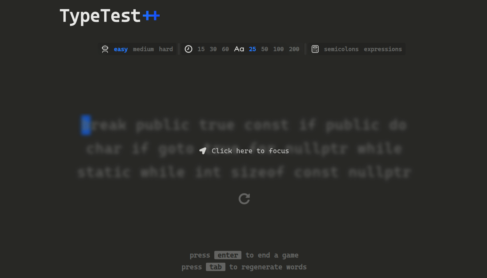

# TypeTest++

It's a typing test that generates random **C++ syntax** for you to practice typing speed and accuracy.

**Live Demo:** [neo-brakus.github.io/TypeTestCpp](https://neo-brakus.github.io/TypeTestCpp/)

